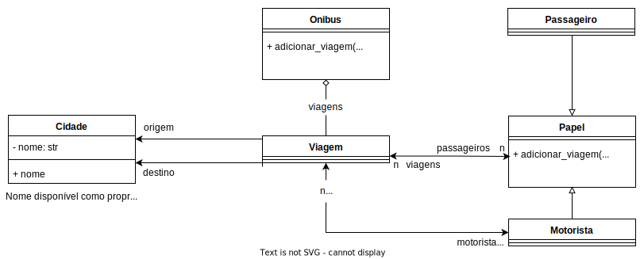

# Módulo T19

Implementação do módulo t19, a partir do exercício [proposto pelo professor](https://github.com/kyriosdata/oo/blob/master/topicos/19.md)

Alteração feita no módulo ônibus, conforme comentário no arquivo onibus.py
